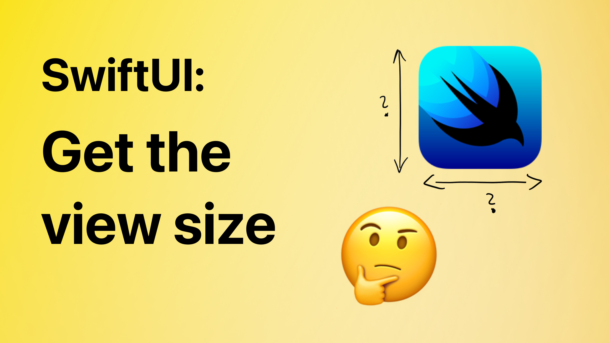

# How to get a view size in SwiftUI

This is the code from the YT video "How to get a view size in SwiftUI" 🤗

You will learn how to get a view size in SwiftUI. Enjoy 🤓

## Links:
- [Link to the video](https://www.youtube.com/watch?v=H6S5xKgb9k8)
- [GeometryReader](https://developer.apple.com/documentation/swiftui/geometryreader/)
- [PreferenceKey](https://developer.apple.com/documentation/swiftui/preferencekey)